# 🍵 Tea Co.

**Tea Co.** is a modern Flutter e-commerce app for browsing and ordering organic teas & coffees. It features a clean onboarding flow, Supabase-powered authentication, a searchable product catalog, and a full cart-to-checkout ordering experience.

---

## ✨ Features

- 🎬 **Animated Splash Screen** — branded intro with smooth transitions
- 🔐 **Authentication** — login, sign up, and form validation powered by Supabase
- 🏠 **Home Dashboard** — personalized greeting, special offers, and popular products
- 📚 **Catalog & Categories** — browse by category (Traditional Teas, Hot Coffees, etc.) with live search
- 🛒 **Cart Management** — add/remove items, adjust quantities, view running total
- 📦 **Checkout Flow** — delivery details form with validation
- ✅ **Order Confirmation** — success screen with order summary
- 👤 **Profile Management** — view account details and logout

---

## 📱 Screenshots

| Splash Screen | Home | Login | Sign Up |
|:---:|:---:|:---:|:---:|
| 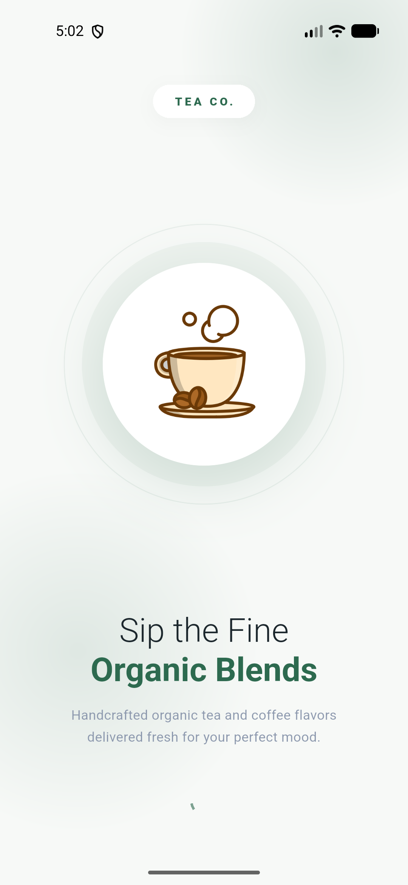 | 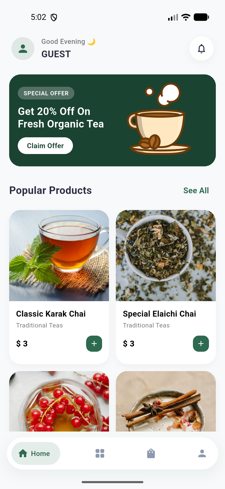 | 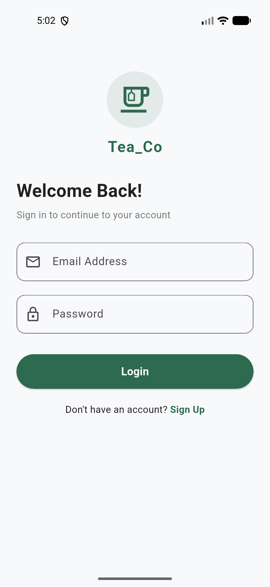 | 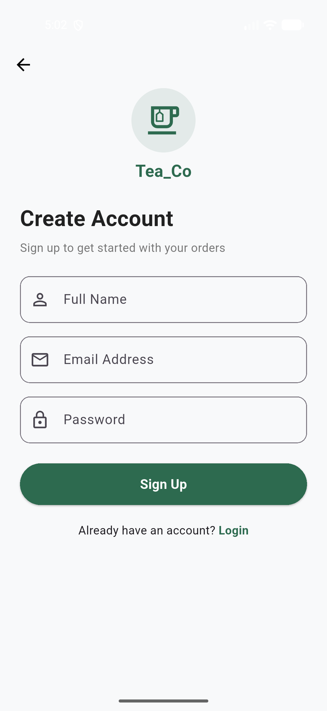 |

| Home (Logged In) | Profile | Catalog | Catalog Search |
|:---:|:---:|:---:|:---:|
| 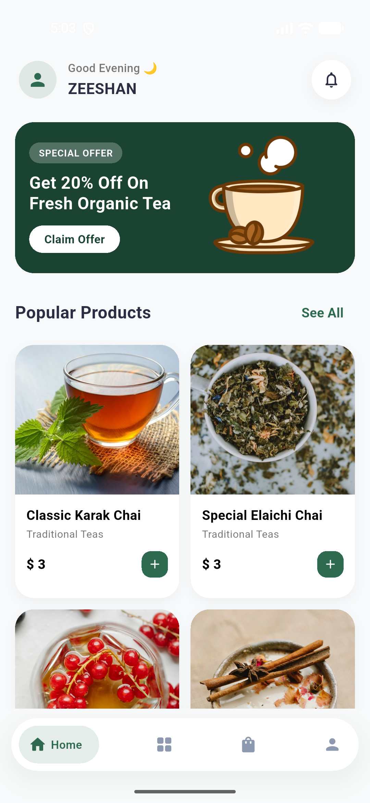 | 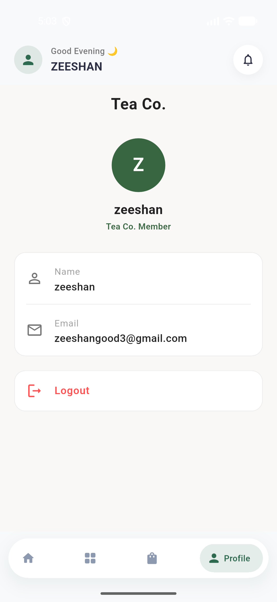 | 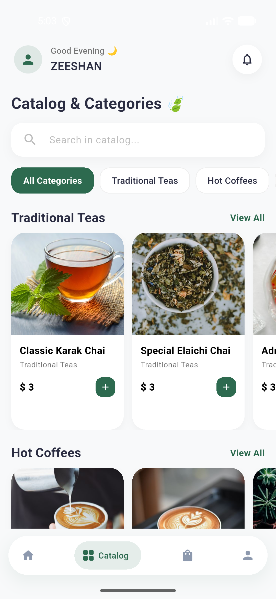 | 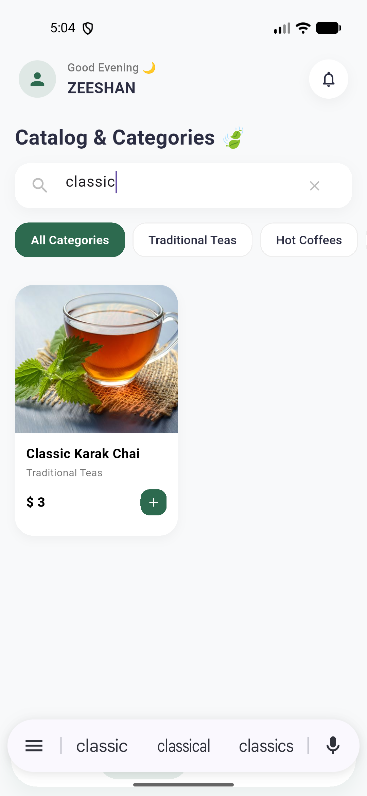 |

| Product Detail | Cart | Checkout | Order Success |
|:---:|:---:|:---:|:---:|
| 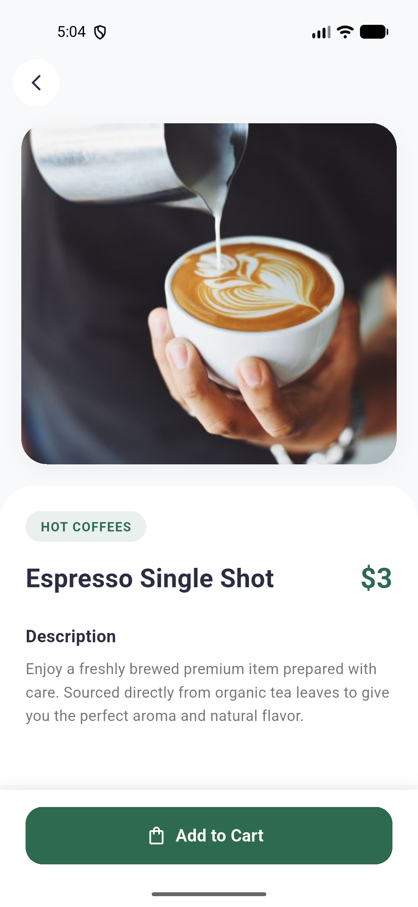 | 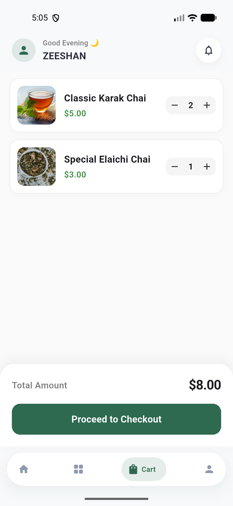 | 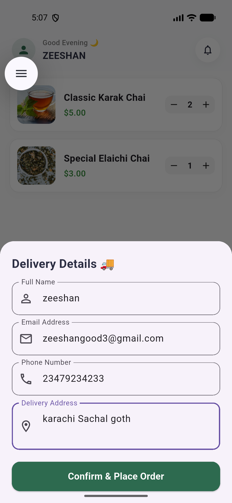 | 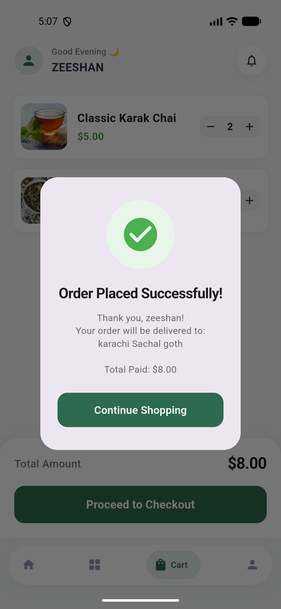 |

<details>
<summary>📷 View all screenshots</summary>

| | | |
|:---:|:---:|:---:|
|  |  | 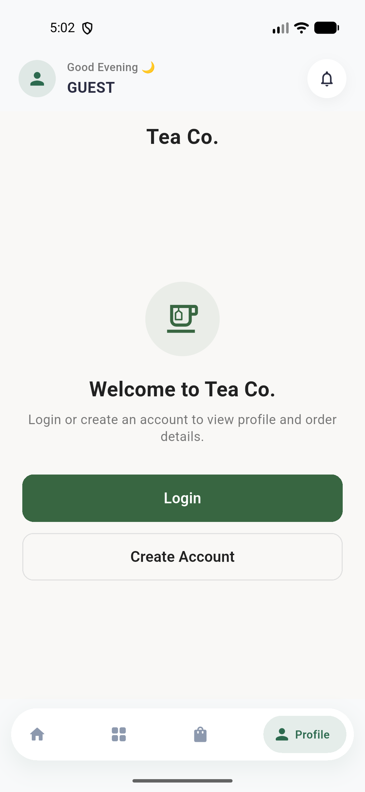 |
|  |  | 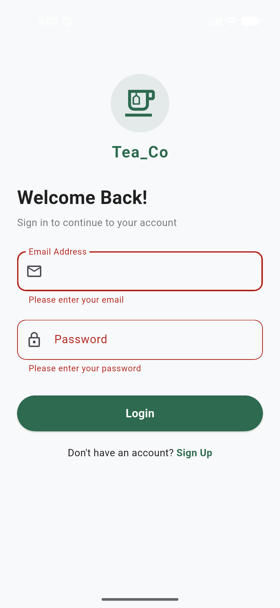 |
|  |  |  |
| 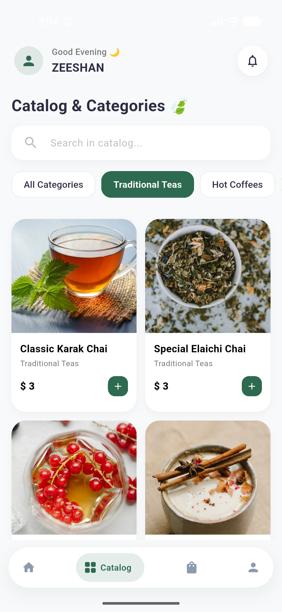 |  |  |
|  | 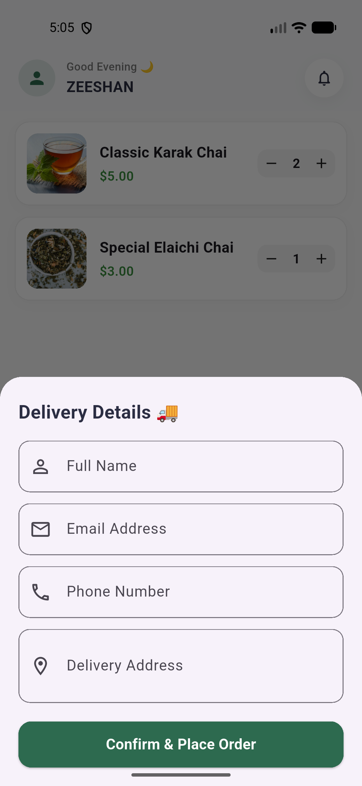 |  |
|  | | |

</details>

---

## 🛠️ Tech Stack

- **[Flutter](https://flutter.dev)** — cross-platform UI framework
- **[Supabase](https://supabase.com)** (`supabase_flutter`) — authentication & backend
- **`google_nav_bar`** — bottom navigation bar
- **`shared_preferences`** — local storage
- **`splash_master`** — native splash screen generation
- **`flutter_animate`** — UI animations
- **`flutter_launcher_icons`** — app icon generation

**Platforms:** Android · iOS · Web · Windows

---

## 🚀 Getting Started

### Prerequisites
- [Flutter SDK](https://docs.flutter.dev/get-started/install) (Dart SDK `^3.12.2`)
- A [Supabase](https://supabase.com) project (URL + anon key)

### Installation

```bash
# Clone the repository
git clone https://github.com/zeeshanleghari/tea_co.git
cd tea_co

# Install dependencies
flutter pub get

# Run the app
flutter run
```

### Supabase Setup
Add your Supabase project credentials (URL and anon key) wherever the app initializes Supabase (e.g. in `main.dart` or an `.env` file), then re-run the app.

---

## 📂 Project Structure

```
tea_co/
├── android/          # Android platform files
├── ios/               # iOS platform files
├── web/               # Web platform files
├── windows/           # Windows platform files
├── lib/               # App source code (screens, widgets, assets)
├── test/              # Unit & widget tests
├── pubspec.yaml       # Dependencies & app metadata
└── README.md
```

---

